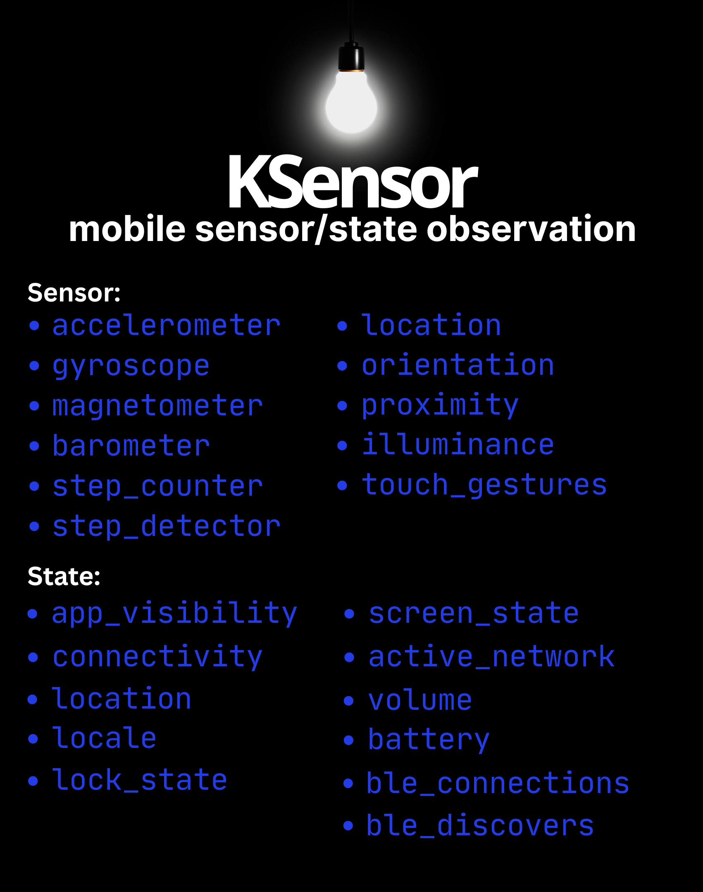

[](https://kotlinlang.org/)
[](https://gradle.org/)
[](https://opensource.org/licenses/0BSD)

<p align="center">
  
</p>

# KSensor

KSensor is a plugin-based Kotlin Multiplatform library for observing device sensors and system states. Each sensor or state is grouped into its own plugin, allowing you to include only the features you need. This prevents pulling in unnecessary code and permissions.

All data emitted by plugins is wrapped in a `KSensorResponse<T>` which includes:
- `data`: The actual sensor or state data.
- `platform`: The platform type (Android or iOS).
- `timestamp`: The system time when the data was collected.

## Permissions Handling

Some plugins require system permissions to function. Each plugin exposes a `requiredPermissions` list indicating what it needs. KSensor provides a `PermissionHandler` interface in the Core module to help check and request these permissions across platforms.

### Core Permission API
```kotlin
interface PermissionHandler {
    fun hasPermission(permission: Permission): Boolean
    suspend fun requestPermission(permission: Permission): Boolean
}
```

You must ensure that the necessary permissions are granted before starting sensor observations. Each plugin section below lists its required permissions.

---

## Core Module

The foundation of the library. It is required for all plugins.

Dependency:
```kotlin
implementation("io.github.shadadman:ksensor-core:2.0.0")
```

## Motion Sensors Plugin

Provides access to hardware sensors for tracking movement.

Dependency:
```kotlin
implementation("io.github.shadadman:ksensor-sensors-motion:2.0.0")
```

Required Permissions:
- Android: `ACTIVITY_RECOGNITION` (Required for Step Counter)
- iOS: `ACTIVITY_RECOGNITION` (Motion & Fitness)

Data Models (Wrapped in `KSensorResponse`):

- Accelerometer: `Accelerometer(values: Vector3)`
- Gyroscope: `Gyroscope(values: Vector3)`
- Step Counter: `StepCounter(steps: Int)`
- Step Detector: `StepDetector` (data object)

## Environment Sensors Plugin

Provides data from sensors that monitor the ambient environment.

Dependency:
```kotlin
implementation("io.github.shadadman:ksensor-sensors-environment:2.0.0")
```

Required Permissions: None

Data Models (Wrapped in `KSensorResponse`):

- Barometer: `Barometer(pressure: Float)`
- Light: `LightIlluminance(illuminance: Float)`
- Proximity: `Proximity(distanceInCM: Float, isNear: Boolean)`

## Positioning Sensors Plugin

Provides location services and spatial orientation data.

Dependency:
```kotlin
implementation("io.github.shadadman:ksensor-sensors-positioning:2.0.0")
```

Required Permissions:
- Android/iOS: `LOCATION`

Data Models (Wrapped in `KSensorResponse`):

- Location: `Location(latitude: Double?, longitude: Double?, altitude: Double?)`
- Magnetometer: `Magnetometer(values: Vector3)`
- Orientation: `Orientation(orientation: DeviceOrientation, orientationInt: Int)`
- Location Status: `LocationStatus(isLocationOn: Boolean)`

## Interaction Sensors Plugin

Provides high-level data related to user input gestures.

Dependency:
```kotlin
implementation("io.github.shadadman:ksensor-sensors-interaction:2.0.0")
```

Required Permissions: None

Data Models (Wrapped in `KSensorResponse`):

- Touch Gestures: `TouchGestures(x: Float, y: Float, type: TouchGestureType)`

## Network States Plugin

Provides information about the network connectivity of the device.

Dependency:
```kotlin
implementation("io.github.shadadman:ksensor-states-network:2.0.0")
```

Required Permissions: None

Data Models (Wrapped in `KSensorResponse`):

- Connectivity: `ConnectivityStatus(isConnected: Boolean)`
- Active Network: `CurrentActiveNetwork(activeNetwork: ActiveNetwork)` (Values: WIFI, CELLULAR, NONE)

## System States Plugin

Provides access to general device system states like battery and volume.

Dependency:
```kotlin
implementation("io.github.shadadman:ksensor-states-system:2.0.0")
```

Required Permissions: None

Data Models (Wrapped in `KSensorResponse`):

- Battery: `BatteryStatus(levelPercent: Int?, chargingState: ChargingState, health: BatteryHealth?, temperatureC: Float?)`
- Volume: `VolumeStatus(volumePercentage: Int)`
- Locale: `LocaleStatus(languageCode: String, countryCode: String, fullLocaleString: String, displayName: String, isRTL: Boolean)`
- Screen: `ScreenStatus(isScreenOn: Boolean)`
- Lock: `LockStatus(isDeviceLocked: Boolean)`

## Bluetooth States Plugin

Provides monitoring for BLE connection and discovery events.

Dependency:
```kotlin
implementation("io.github.shadadman:ksensor-states-bluetooth:2.0.0")
```

Required Permissions:
- Android/iOS: `BLUETOOTH`

Data Models (Wrapped in `KSensorResponse`):

- BLE Connections: `BleConnectionStatus(connectedDevices: List<BleDevice>)`
- BLE Discoveries: `BleDiscoversStatus(discoveredDevices: List<BleDevice>)`
- BLE Device: `BleDevice(id: String, name: String)`

## Lifecycle States Plugin

Tracks the visibility and lifecycle state of the application.

Dependency:
```kotlin
implementation("io.github.shadadman:ksensor-states-lifecycle:2.0.0")
```

Required Permissions: None

Data Models (Wrapped in `KSensorResponse`):

- App Visibility: `AppVisibilityStatus(isAppVisible: Boolean)`

## Basic Usage

1. Register your plugin implementation.
2. Use the `KSensor` registry to retrieve the plugin and observe its data using Kotlin Flow.

Example:
```kotlin
// Register a plugin
KSensor.register(createMotionPlugin())

// Retrieve and observe
val motion = KSensor.get<MotionPlugin>(PluginId.MOTION)
motion?.accelerometer()?.collect { response ->
    // response.data contains the Accelerometer values
    // response.platform indicates if it is Android or iOS
    // response.timestamp indicates when the data was recorded
    println("Platform: ${response.platform}, Data: ${response.data}")
}
```

## License

Copyright (c) 2025 KSensor

Permission to use, copy, modify, and/or distribute this software for any purpose
with or without fee is hereby granted.

THE SOFTWARE IS PROVIDED "AS IS" AND THE AUTHOR DISCLAIMS ALL WARRANTIES
WITH REGARD TO THIS SOFTWARE INCLUDING ALL IMPLIED WARRANTIES OF
MERCHANTABILITY AND FITNESS. IN NO EVENT SHALL THE AUTHOR BE LIABLE FOR
ANY SPECIAL, DIRECT, INDIRECT, OR CONSEQUENTIAL DAMAGES OR ANY DAMAGES
WHATSOEVER RESULTING FROM LOSS OF USE, DATA OR PROFITS, WHETHER IN AN
ACTION OF CONTRACT, NEGLIGENCE OR OTHER TORTIOUS ACTION, ARISING OUT OF
OR IN CONNECTION WITH THE USE OR PERFORMANCE OF THIS SOFTWARE.
